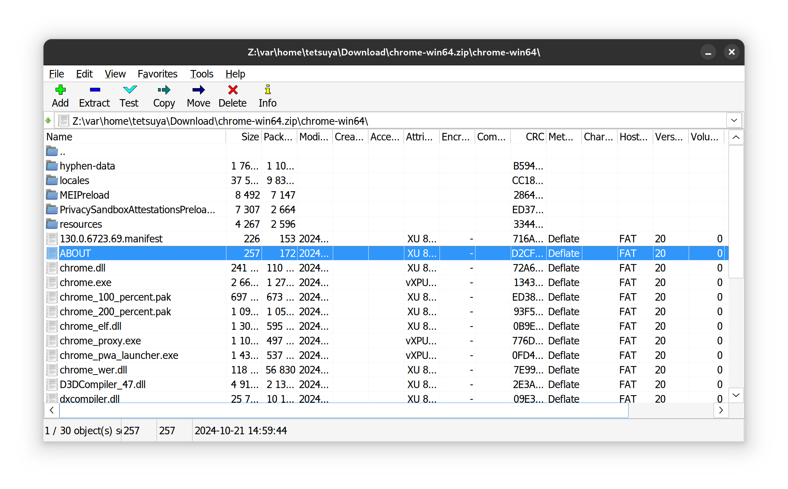
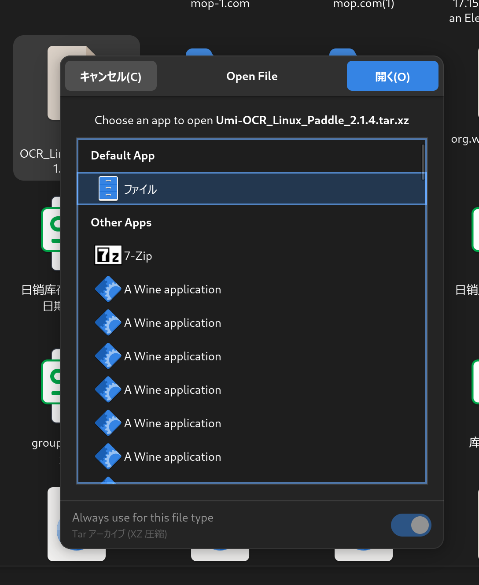

# 7-Zip AppImage for Linux

7-Zip AppImage for Linux is a portable package of 7-Zip file archiver running on Wine.
7-Zip AppImage for Linux は、Wine 上で動作する 7-Zip ファイルアーカイバのポータブルパッケージです。
7-Zip AppImage for Linux 是一个基于 Wine 运行的 7-Zip 文件压缩程序的便携包。

This is a Windows 7z program packaged with Wine for Linux environments. It provides both command-line interface and GUI tools. The main purpose is to solve character encoding issues when extracting Windows-created archives on Linux systems.
使用 Wine 打包的 Windows 7z 程序，适用于 Linux 环境。同时提供命令行和图形界面两种使用方式。
解决 Windows 下创建的压缩包在 Linux 系统解压时的[中文乱码问题](https://superuser.com/questions/554108/extracting-a-zip-file-with-japanese-characters-in-the-archive-s-filenames)。
Wine でパッケージ化された Windows 7z プログラムで、Linux 環境用です。コマンドラインとGUI の両方のインターフェースを提供します。
Windows で作成された圧縮ファイルを Linux で解凍する際の文字化けの問題を解決するために開発されました。

### Installation & Usage インストールと使用方法 安装与使用

Simply double-click the downloaded AppImage file to launch. On first run, it will create desktop shortcuts and file associations automatically.
双击 AppImage 文件即可运行。首次启动时会自动创建桌面快捷方式和文件关联。
ダウンロードした AppImage ファイルをダブルクリックするだけで実行できます。初回起動時に、デスクトップショートカットとファイルの関連付けが自動的に作成されます。

### File Operations ファイル操作 文件操作

Right-click any archive and select `7-Zip` from the context menu. The program handles path conversion automatically, allowing seamless compression and extraction operations.
在任意压缩包上右键点击并选择`7-Zip`即可操作。程序会自动处理路径转换，使压缩解压操作更加便捷。
圧縮ファイルを右クリックして`7-Zip`を選択するだけで操作できます。パスの変換は自動的に処理され、圧縮・解凍操作がスムーズに行えます。

### Command Line Interface コマンドライン インターフェース 命令行界面

The program fully supports native 7z command-line operations. Example usage:
完全支持 7z 原生命令行操作。使用示例：
7z ネイティブのコマンドライン操作を完全にサポートしています。使用例：

`./7-Zip-x86_64.AppImage a ~/Download/test.7z ~/Download/test`

This will generate a test.7z file in the Download directory.
运行后会Download下生成 test.7z 文件。
実行後、Download ディレクトリに test.7z ファイルが生成されます。

#### Supported 7z Commands 7z 支持的命令 7z がサポートするコマンド

* `7z`: Run 7z
* `a`: Add files to archive
* `b`: Benchmark
* `d`: Delete files from archive
* `e`: Extract files from archive
* `h`: Show help
* `i`: Show information about supported formats
* `l`: List files in archive
* `rn`: Rename files in archive
* `t`: Test integrity of archive
* `u`: Update files in archive
* `x`: eXtract files with full paths

### Configuration 配置 設定

The program is packaged with wine and can be configured using the following commands:
程序是通过 wine 打包的，可以通过以下命令配置 wine 环境：
プログラムは wine でパッケージ化されており、以下のコマンドで wine 環境を設定できます：

* `wine`: Run wine
* `winecfg`: Run winecfg
* `wineserver`: Run wineserver
* `wineboot`: Run wineboot
* `winetricks`: Run winetricks

## Copyright

Copyright (c) 2024 Cheyan <iamcheyan@gmail.com> https://iamcheyan.com/
7-Zip is Copyright (c) 1999-2024 Igor Pavlov
Wine is Copyright (c) 1993-2024 Wine Developers
